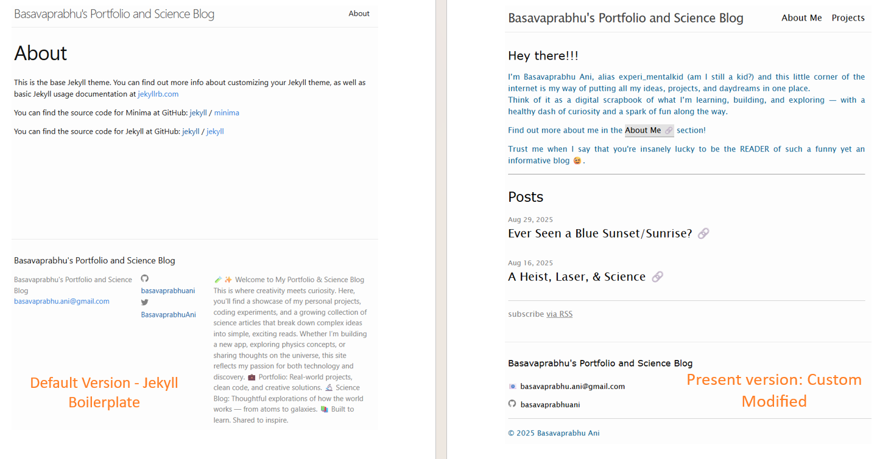

This project, is this exact website which you're scrolling through right now. This website has been built using Jekyll and hosting it with GitHub Pages. Since you're already reading this, I suppose I needn't explain <i>how</i> this works 😜. 

 
 <h3>GitHub Repo</h3>

View the GitHub repository for the files used to build this site on  <a href="https://github.com/basavaprabhuani/basavaprabhuani.github.io" class="content-link">here</a>

 
<figure>
    
    <figcaption>Image of GitHub Repo</figcaption>
</figure>

I’ve made the entire source code for this site public. You can freely explore the CSS styling, as well as the structure and format I’ve set up for adding new pages and posts to the blog. Whether you're curious about how it works, want to reuse it, or simply learn from it, everything is laid out for easy browsing and understanding.

 
 <h3>Why I built It</h3>

As you might have guessed it, reading the contents of any part of this site, you would have noticed that the purpose of this whole thing is to showcase myself - My skills, my interests, and my progress towards becoming better consistently.  Not just this, this also serves a log for the concepts that I stumble across or wonder the reason for <i>why</i> something happens, which I add regularly to the <b>Posts</b> section in the home page. 

This website also serves as my portfolio, along with the display of my projects, as I build them and implement them for something.

 
 <h3>How I built It</h3>

This site, as mentioned before, has been built using Jekyll. The basic setting-up of the layout, and integrating the different requirements required to launch this site, all this has been done by merely following the instructions given in the <a href="https://docs.github.com/en/pages/quickstart" class=content-link>Documentation of GitHub Pages</a>

While the boilerplate has had zero involvement of my intelligence or thinking, whatever after setting up of the layout has been done by myself, be it the content (obviously), the format, the style of font, links, etc., has been done by myself which actually required my active involvement and processing of information and working around the CSS Styling.

Here is the image showing the comparison between the boilerplate Jekyll site and my version:

<figure>
    
    <figcaption>Image showing difference between the two versions</figcaption>
</figure>

