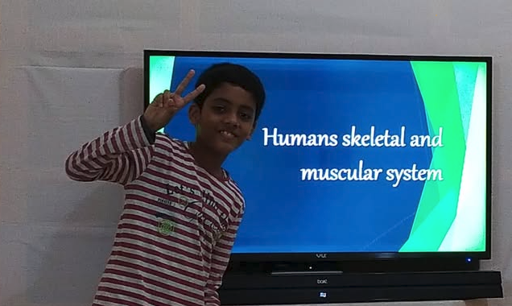

I like to think of 06/07/2010 as the day on which a legend (hopefully) was born; 'cuz that's when I was born 😊.

I spend a major part of my time (more than 60%) in academics-the usual (and boring) school, but mostly FUN Science & Math. While I find Science & Math highly entertaining, unfortunately "that's not everything in life". So, to pass my time while having fun and educating myself at the same time, I do many other things as well, which brings us to the topic of my hobbies.

Doing many activities are enjoyed by me - Coding, watching movies & playing games (but then again, who doesn't enjoy this), digging up for the reasons for many natural phenomena within the body and the universe to quench my curiosity, to name a few. I learnt how to code (in python) when I was of age 11, primarily because I had seen my brother, <a class="content-link" href="https://www.linkedin.com/in/allamaprabhu-ani/">Allamaprabhu Ani</a>, using VBA, another coding language, to automate some tedious tasks of mine which I had to do as a part of my academics on the computer (like writing down the meanings of new words I come across in my textbooks in excel). Events like these ignited my curiosity into learning how to code and implement that knowledge into automating my own tedious tasks of day-to-day life on the computer (FYI I have also attached my own version of the program mentioned above, which I had written using Python, on GitHub). Though I haven't really written many programs to serve the aforementioned purpose, I have certainly written programs as a pass-time. Programming has genuinely enhanced my logically-thinking skills as, one has to use one's brain to write a program.  
Coming to my less-important hobbies, i.e., watching movies and playing games, I love action movies but mostly sci-fi ones like Iron Man, Interstellar or any other movies which could be the potential future of Humanity and the Earth. For action movies, my go-to would be anything similar to John Wick. But mostly, I focus on watching either Sci-Fi (which cover up for 60% of the movies I watch), or humorous ones. And oh! how could I forget!? YOUNG SHELDON. I kinda feel both him and I are the same, but neither am I insanely condescending nor am I as knowledgable (mind me, 'knowledgable', not smart) as him.  
I have developed a keen interest on the Youtube Channel <a class="content-link" href = "https://www.youtube.com/startalk"><i>StarTalk</i></a>, starring Neil DeGrasse Tyson, who humorously explains concepts explaining phenomena in nature. I love the way he does infotainment-he is way too humorous, and way too informative at the same time. 

Definitely not to boast, but my hold over the English grammar and vital parts of it-including composition- is proficient. So proficient, that my brother genuinely seeks my approval of an important document that he has written, which he would need to submit officially, not for his English is worse, but for he believes I am proficient and critical in the usage of correct grammar and puncuation.  
Not only English, but I speak 4 other langues - Kannada, Hindi, Tamil, and French (broken, but manageable). Sadly, however, I am forced to be the "Jack of all trades, Master of ONE". I guess that still makes me a polyglot 😎. 
 
When it comes to music, I can play the flute-at least the basics-which is definitely not something notable, since all I can play are the <i>sargam</i>. I definitely want to build up my flute skills, for I do not want to be 'that nerd kid' or 'the booky-guy'.  
Not only music of mine, but I do love pop music of my favourite artists - Taylor Swift, Pitbull & The Weeknd, to name a few. One might say that the music I play and the music I listen to are of stark contrast. 

 
<h3>My Love for Science</h3>

I insanely adore science, because for everything occurring in nature, there is a definite pattern and a reason for why something happens. Nothing is 'unpredictable', but ironically, such is nature. There is nothing 'mysterious' — and even if there is, it isn’t magic or something unexplainable.

Science shows me that behind every mystery lies an answer waiting to be found — hidden in data, experiments, and the patient eyes of those who dare to look closer. It teaches me that the universe doesn’t work on whims or miracles but on rules and patterns, written in the language of physics, chemistry, biology, and math.

I love how science doesn’t just give me facts to memorize — it gives me ways to think. It tells me to question what I see, test what I believe, and stay curious even when the answers are far away. It humbles me, too, because no matter how much we know, there is always more we don’t.

It’s comforting to me that the same laws that keep planets in orbit also hold together the atoms in my body. That the chaotic swirl of weather patterns still follows equations. That even the randomness of life has rules buried deep inside it, waiting to be discovered by someone brave enough to ask “why?” one more time.

One of the things which first piqued my interest in Science, was the working of the human body. This working of the body (muscles, the nervous system, bones, etc.) had fascinated me immensely when I came across this, which was sometime during my 4th grade.  Here's a fun picture of me, all riled-up to teach my home-ies (my fam, hehe) about this:  
<figure>
    

    <figcaption>Cracked at this — had to pass the wisdom to my fam 🐐</figcaption>
</figure> 

To me, loving science means loving the endless adventure of learning. It means accepting that mistakes and failures aren’t dead ends but stepping stones to deeper understanding. It means believing that the universe wants to be understood — and that we, with our tiny sparks of curiosity, have the power to understand it.

That’s why I love science — because it turns the ordinary into the extraordinary and the impossible into the inevitable. Because it reminds me that mystery isn’t the absence of knowledge — it’s the promise of discovery.

Not only Science, but my love for animals-all kinds, is HUUUUGEE. I remember binge-watching five series of National Geographic shows of animals the whole day, and realizing it was time to sleep after 10 hours, but it felt like a heartbeat. I have always been fascinated by the unimaginable methods that animals have adapted to survive. There's all kinds of animals, and they come in all colours. Sometimes, I just think of the havoc humans have wreaked on nature and the misery WE have caused to innocent, shy creatures who mean no harm to anyone, except for their prey, of course. It is cruel of us to eat away all the resources nature has provided to ALL THE ANIMALS, and NOT JUST HUMANS. In the name of development, we never thought of the misery we would cause to development. But surprisingly, everyone seems to have woken up regarding this matter after all the damage has been done. 

 

 
<h3>My Aim</h3>

Here comes the most important part of this whole blog - MY AIM (mind it, not a 'dream' but an AIM). 
I aspire to become a phycisist, because I have been fascinated by the astonishing, yet logical and systematic, reasons for various phenomena in the universe, like why the Earth goes around the sun, why doesn't a person on the south-pole fall down into the vast universe (which is kinda silly, but still thought-provoking), and why the sky is never blue at the time of sunset or sunrise. 
Before becoming a physicist, I need to study in a university (I bet you didn't know that 😂). And for this, I want to study in MIT - that's right, the place where Tony Stark studied (I know he's ficitonal. Just Saying.). My efforts are 100% into getting into MIT, and I am definitely not joking about this. I am seriously diligent and determined to become worthy of studying in MIT, by hook or crook. 
I want to study in MIT, because that's the place where problems are solved, and innovations are made. I'm not saying stuff like that doesn't happen in other universities, but it's at MIT, where you get to collaborate with people of various backgrounds and therefore have fresh thoughts and ideas on solving the world's problems.  To be completely honest, that's not all that inspires me-it's also the pride of being able to study in #1 University of the world, by being the best-of-the-best. 

 

Further, in this website of mine, I will be consistently adding new stuff about things that I discover-primarily regarding Science & Math, and computer-science as well, to some extent, and you can find these posts in-you guessed it-the <i>Posts</i> section at the end of the <a class = "content-link" href="https://basavaprabhuani.github.io/">Home page.</a>

 

 

